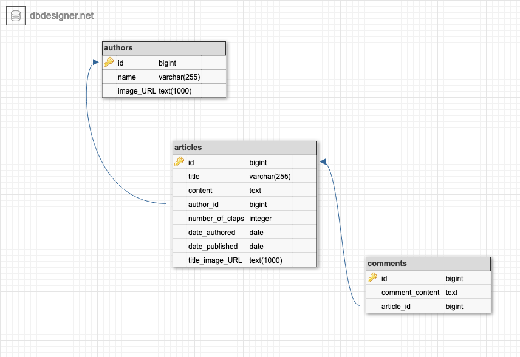
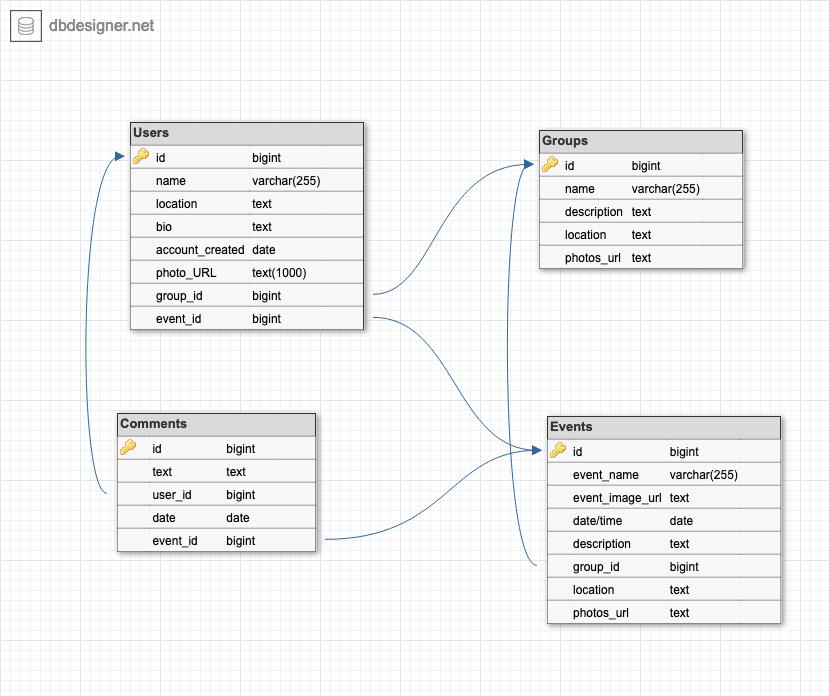

# Max's Notes - Day 21

## Entity Relationship Diagram (ERD)
- Primary Key: This is something that identifies every row in your table. It's generally an integer and needs to be unique for every row.
- Foreign key: Something that points to a key in another table

- Creating a ERD you can use a software like this - https://app.dbdesigner.net/designer/schema/new
  - A varchar is a string
- Example of a database creation is below 

- Another example:

## Roddy run through of building the MyMedium app. 
- This is in relation to the data base above

- `rails generate scaffold Author name:string image_url:text` - generating the author scaffold.
- When you're doing the `belong_to` its always singular and `has_many` is plueral so everything has a `s` on the end