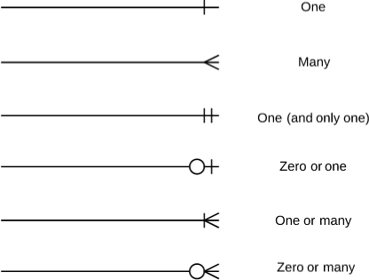
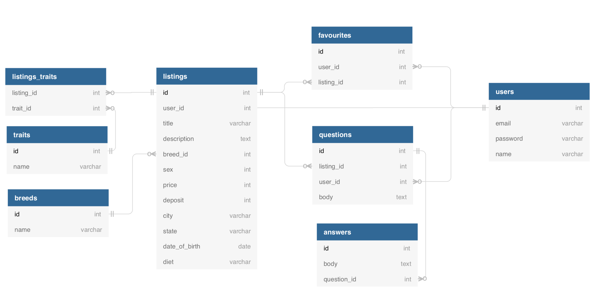

# Max's Notes

### Helpful random notes:

- To set it up so the site handles when there is not page to the path use the below in routes:
  - `get "*path", to: "pages#not_found"` - The * says if it doesn't recognise a path it will go to not_found html. 
For more information on this day visit - https://coderacademy.instructure.com/courses/240/pages/erd-and-forms-the-rails-way?module_item_id=9585 

- Defaulting an input date field. To do this you can put in your controller the default field you want in the method new: 
  -  `@listing.date_of_birth = "1971-01-01"` - This is an example of how you can do it. You list the instance then column you want to default then the value.

- GEM Byebug allows you to find out whats breaking in your program while its running. To install type `gem install byebug`
  - To use in code type `byebug` this will kick in when the program runs the code. You can see this in the terminal.
  - You can then type `next` to run the next bit of code.
  - You can also type `step` which steps into the function or command
  - Type `help` to show all the commands

- Handling forgin ID's with creations you need to make sure the user is selecting an idea. As you can see below in the drop down you can add a select to the form. This will create an Id on the foregin key. See example below:
- The keys at the end is because of the enum number key.
  ```
  <div>
    <%= form.label :sex %>
    <%= form.select :sex, options_for_select( Listing.sexes.keys ) %>
  </div>
  ```

- Form best practice - When you're creating a partial form and passing it across a create function and edit function you should pass the instance in through the render command
  - `<%= render "shared/listing_form", listing: @listing %>` 
  - The form will then instead be: `<%= form_with model: listing, local:true do |form| %>` (This is only the top of the form)

- How to keep pervious drop down selected the same as what the user selected. If the user is selecting from a drop down and they want to edit the drop down again the drop down will default back to the top option. To do this go to the form and change the select option to the below: 
  - `<%= form.select :breed_id, options_for_select(Breed.all.collect { |u| [u.name, u.id] }, :selected => listing.breed_id) %>`


## Entity relationship Diagrams

- Good sources to create these is: 1. https://www.draw.io/





## Enum

- Enums are there for the programers not the users. Its things that the user will not change such as their sex etc...
- Enumerated type is a data type consisting of a set of named values. It is really great for representing workflows or a small list of values. For example we could use an enum in a blogging application to state whether a post is a draft or published.
- Enums are really good because the attribute value must be equal to one of the values that have been predefined for it. In our example we have two predefined values (female, male). That means our snakes sex cannot be anything other than these two values. The other thing you may have noticed about our enum is that we are using a hash to define these values. The key in the hash is what Rails uses however the value is what is actually stored in the database. The reason we are using an integer value is because integers are actually quicker to lookup in a database than a string.

- Examples of Enums: The below basically defines numbers as values of sex. So below says 0 is defined by female and 1 is male. - This is setup in your models and is a variable type passed in to your functions.
- When you set up your database you set the column datatype as integer. So "sex" was set up as sex:integer.
```
class Breed < ApplicationRecord
  enum :sex: {female: 0, male: 1}
end
```
- You can then apply this to the code or in rails c by doing the below:
  - `Listing.create(sex: "female", breed: Breed.first)` - This basically now assigns sex as 0 but we can still call `"female"`
  - 

### Before Action Command

- The before action allows us to run one command instead of three. It says basically it is going to run show, edit, update and destroy. So before you do any actions its going to call set_listing.

```
class ListingsController < ApplicationController
  # The before action allows us to run one command instead of three. It says basically it is going to run show, edit, update and destroy. So before you do any actions its going to call set_listing
  before_action :set_listing, only: [ :show, :edit, :update ,:destory]
  def index
    @listings = Listing.all
  end

  def show

  end

  def new

  end

  def create
    #finish logic for creating a record
  end

  def edit

  end

  def update

  end

  def destroy

  end

  # Anything below the word private will not be avaliable to anything other than the controller
  private
  # The point of the below is that it allows us to run the methods above once. The code below was once in all the above methods but we have deleted it.
  def set_listing
    id = params[:id]
    @listing = Listing.find(id)
  end

end
```


