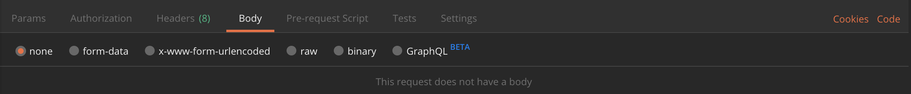
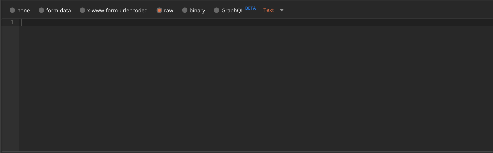
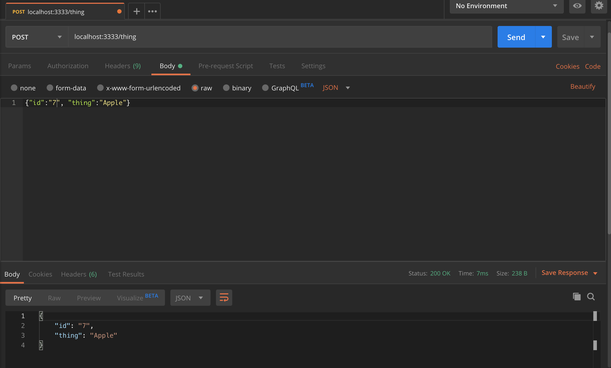

# Max's notes

## Creating an API with node & express

- Below are the basic steps to installing Node and express

1. In your directory run `npm init`
2. You will then be asked to fill in the basic requirements such as name, lisence etc.. you can press enter on all of these if you like.
3. You then want to run `npm install express --save` this will create express in your directory.
4. Then create your javascript file
5. In the JS file put `const express = require('express');` at the top
6. Then create a new app instance like `const app = new express();`.
7. You then want to assign it a port with `const port = 3333;`
8. You then want to add the below code.
```
app.get("/", (request, response) => {
  return response.send("Hello world");
});
```
9. And then want to add a listener to that port so it can listen for changes and more.
```
app.listen(port, () => {
  console.log("Running")
})
```
10. You then need to start your server by running `node <fileName>.js`
11. To add a new 'page' you just add a new `app.get`. An example is below: This means if you go to `http://localhost:3333/test` it will take you to the below and display that. 
```
app.get("/test", (request, response) => {
  return response.send("From inside test")
});
```
12. NOTE: You will need to restart the server each time to see the changes. HOWEVER a way around this is installing nodemon
  - In your directory run `npm install --save-dev nodemon` this installs the dependancy into the development env only. It means it won't get pushed to live.
  - This means that nodemon will listen for any changes in your files and restart the server automatically.
13. You then go to your `package.json` and in `"scripts: {}` add the below
  - Add `"start": "nodemon api.js",` so it looks like the below
  ```
  "scripts": {
    "start": "nodemon api.js",
    "test": "echo \"Error: no test specified\" && exit 1"
  },
  ```
14. Now instead of doing `node api.js` you simply have to do `npm start`

- Below is the whole code for the `api.js` file:

```
const express = require('express');

// Create a new instance of express
const app = new express();

// This creates the port for your site
const port = 3333;

app.get("/", (request, response) => {
  return response.send("<h1>Hello Max</h1>");
});

app.get("/test", (request, response) => {
  return response.send("From inside test")
});

app.listen(port, () => {
  console.log("Running")
});
```

## Doing things in your API 

- The below is an example of how we display data back to the user.
- The below returns a JSON file back.
- You will see we create an array of objects, then we use `app.get` and the response sends back the `things` array. If you then type in `http://localhost:3333/things` it will return the JSON file.

```
const things = [
  { id: 1, thing: "Max 1"},
  { id: 1, thing: "Max 1" },
  { id: 1, thing: "Max 1" },
  { id: 1, thing: "Max 1" },
  { id: 1, thing: "Max 1" }
];

app.get("/", (request, response) => {
  return response.send("<h1>Hello Max</h1>");
});

app.get("/things", (request, response) => {
  return response.send(things);
})

app.get("/test", (request, response) => {
  return response.send("From inside test")
});

app.listen(port, () => {
  console.log("Running")
});
```

- A way to reterive params and more. 
- The below is saying console.log the params. NOTE the console is logged to your terminal not browser console. Also you need to be on the page `"/things"`

```
app.get("/things", (request, response) => {
  console.log(response.params);
});
```

### The below is a way to retreive one object from the array.
- The below takes the id from the array of objects.

```
app.get("/things/:id", (request, response) => {

  const { id } = request.params;
  // Taking the Id from the request and returning it into an integer
  const intId = parseInt(id);
  // The below code looks through the things array
  const thing = things.find((element) => element.id === intId);
  console.log("Id is: " + id);

  return response.send(thing);
});
```


### Returning an error from API call

```
app.get("/things/:id", (request, response) => {

  // The ID is coming from the array of objects

  const { id } = request.params;
  // Taking the Id from the request and returning it into an integer
  const intId = parseInt(id);
  // The below code looks through the things array
  const thing = things.find((element) => element.id === intId);
  
  // The below says if the id isn't in the thing array then it returns the error.
  if(thing) {
    response.send(thing)  
  } else {
    return response.status(404).send(`Thing with an id of ${id} not found`)
  }

  return response;
});
```

### Creating a new record
- To create and use a post request you must include this in your code above `app.use(express.json());`
- The below is a way of creating and posting data. The big IF statement is a way to handle the quality of the data.

```
// The below is a post of data.
app.post('/thing', (request, response) => {

  // The below takes the ID from the array of objects thing
  const {id, thing } = request.body;

  // This checks if the data is valid.
  if ((!id) || (!thing)) {
    response.status(400).send("Both an id and thing have to be set to create a new thing");
    // The below checks if the id is a number and is greater or equal to 0
  } else if(parseInt(id) <= 0 || (thing.length < 3)) {
    response.status(400).send("Data formating is invalid");
    // The below is then checking if the element exists or not
  } else if(things.find( (element) => element.id == id)) {
    response.status(400).send("Thing with this id already exists")
    // Finally if all pass then it creates the ID
  } else {
    const newThing = {id: id, thing: thing};
    things.push(newThing);

    response.send(newThing);
  }

  return response;
});
```

- The next step here is to then to post the data with `postman`
  1. Download the postman app
  2. Then enter into your local host address and change the setting to `post` like the image below:
  
  3. Click send and it should return an error. 
  4. You then want to click body in the above tab like the image below.
  
  5. Then select the `raw` option.
  
  6. Once you've selected `raw` change the drop down from `text` to `JSON`
  7. Then enter the params required to post. The example below is specific to the object. Once entered click send and it should post successfully.
  


### JOI - Improve verification of data quality 

- Joi is a way of making sure the code is the right quality and improves your code so you don't need to add so many if statements 
- Note you must require `Joi` at the top `const Joi = require('joi');`

- Instead of doing the below: THIS IS NOT THE JOI WAY
```
// The below is a post of data.
app.post('/thing', (request, response) => {
  

  // The below takes the ID from the array of objects thing
  const {id, thing } = request.body;

  This checks if the data is valid.
  if ((!id) || (!thing)) {
    response.status(400).send("Both an id and thing have to be set to create a new thing");
    // The below checks if the id is a number and is greater or equal to 0
  } else if(parseInt(id) <= 0 || (thing.length < 3)) {
    response.status(400).send("Data formating is invalid");
    // The below is then checking if the element exists or not
  } else if(things.find( (element) => element.id == id)) {
    response.status(400).send("Thing with this id already exists")
    // Finally if all pass then it creates the ID
  } else {
    const newThing = {id: parseInt(id), thing: thing};
    things.push(newThing);

    response.send(newThing);
  }

  return response;
});
```

- We can now improve this and use `Joi`

```
// The below is a post of data.
app.post('/thing', (request, response) => {
  
  // The below takes the ID from the array of objects thing
  const {id, thing } = request.body;

  // The below is adding verification for the quality of the data using JOI dependancy
  const schema = {
    id: Joi.number().required, - This says that id needs to be a number and is required.
    thing: Joi.string().min(3).required - This is also saying that the thing name must be more than the length of three
  }

  const newThing = {id: parseInt(id), thing: thing};
  const valid = Joi.validate(newThing, schema);

  if (valid.error) {
    response.status(400).send(valid.error.details[0].message);
  } else if (things.find((element) => element.id == id)) {
    response.status(400).send("Thing with this id already exists")
    // Finally if all pass then it creates the ID
  } else {
    const newThing = { id: parseInt(id), thing: thing };
    things.push(newThing);

    response.send(newThing);
  }

  return response;
});
```

### To create a incremental id you can do the below

```
// The below is a post of data.
app.post('/thing', (request, response) => {
  
  // The below takes the ID from the array of objects thing
  const {id, thing } = request.body;

  // The below is adding verification for the quality of the data using JOI dependancy
  const schema = {
    id: Joi.number().required(),
    thing: Joi.string().min(3).required()
  }

  let myNewId = things.reduce((highestId, num ) => {
    return (num.id > highestId) ? num.id : highestId
  }, 0)

  myNewId++;

  const newThing = { id: myNewId, thing: thing };
  const valid = Joi.validate(newThing, schema);

  if (valid.error) {
    response.status(400).send(valid.error.details[0].message);
  } else if (things.find((element) => element.id == id)) {
    response.status(400).send("Thing with this id already exists")
    // Finally if all pass then it creates the ID
  } else {
    things.push(newThing);
    response.send(newThing);
  }

  return response;
});
```

