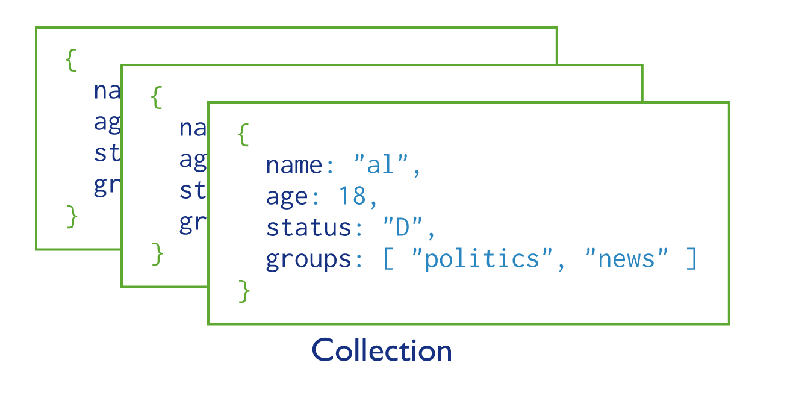

# Day 62 - MongoDB

## MongoDB Terminology

- This is a cross-platform document-oriented database program.
- This is classified as a NoSQL, MongoDB uses JSON-"like" documents.
- For more information 1. https://medium.com/xplenty-blog/the-sql-vs-nosql-difference-mysql-vs-mongodb-32c9980e67b2 2. https://www.thegeekstuff.com/2014/01/sql-vs-nosql-db/embed/ 3. https://gist.github.com/aponxi/4380516 

- A Document si simply a data structure composed of field and value pairs e.g.
```
{
  name: "Luke Skywalker",
  height: "172",
  mass: "77",
  hair_color: "blond",
  skin_color: "fair",
  eye_color: "blue",
  birth_year: "19BBY"
}
```

- MongoDB terminology compared to relation database e.g. postreSQL
  - Relational Database:
    - Database
    - Table
    - Rows/Records
    - Columns
  - MongoDB
    - Database
    - Collection
    - Documents
    - Fields

- Specifically, MongoDB stores BSON documents, i.e. data records, in collections and the collections are stored in a database. It is worth noting that collections do not enforce a schema; while the example image below shows the documents all have the same fields, this is not enforced.




## MongoDB Installation 

- Guide: https://docs.mongodb.com/manual/installation/

// The tap command adds reference to a third-party brew repository; the services starts the Mongo DB as an Apple service.
- Step 1: `brew tap mongodb/brew`
- Step 2: `brew install mongodb-community` - NOTE: The MongoDB community version is free
- Step 3: `brew services start mongodb-community` 

- To get into mongo run `brew services start mongodb-community` 
- Once mongo has started then run `mongo` This will give us access to the mongo CLI
- `show dbs` - This shows all the databases in mongo
- `show collections` - This shows all the collections
- `use <dataBaseName>` - This selects or creates a database. It creates the database if it doesn't exit
- `db.createCollection('pokemon')` - This creates the database. NOTE: cannot have '-' in name
- `  db.pokemon.insert({_id: 1, name: "Bulbasaur"})` This creates one 'document'. To insert multiply documents do the below: The `.pokemon` is the collection.
- NOTE: If you don't include an id it will create one for you. This however is one like: `5df02bb9899823a7d09020c2`
```
 db.pokemon.insertMany([
  {
      _id: 2,
      name: "Ivysaur"
  },
  {
      _id: 3,
      name: "Venusaur"
  }
])
```
- `pokemon.find()` - This will spit back all the documents
- `db.pokemon.findOne({name: /Max/})` - This will find a particular document in this example one with max
- `db.pokemon.find().sort({name: 1})` - To find and sort you can do this. NOTE: 1 = Ascending (Alphabetical) -1 = Descending 
- `db.pokemon.find().limit(2)` - This returns only 2 results
- You can also run JavaScript on the data for example do the below: `db.pokemon.find().forEach((element) => print('This name is: ' + element.name))`
- To create an id that increments every record without using the default id go here: https://web.archive.org/web/20151009224806/http://docs.mongodb.org/manual/tutorial/create-an-auto-incrementing-field/ 
- NOTE: You should use the database unique ID as it will always make sure the ID is unique. 
- `db.inventory.find({qty: {$gt: 100}})` - The `$gt` is regex and this means greater
- `db.inventory.createIndex({item: 'text'})` - This creates an index on the item field and searches for text. This speeds up the search and you should assign this only to the main data you're searching for in this case its the item. The 'text' field basically says the `items` is a text, if it was an number then it would be integer


### To Update Documents

- `db.pokemon.update( {name: "Max"}, {$set: {name: "Max Kelly"}})` - This updates the record you can also search by id like `db.pokemon.update({_id: 3}, {$set:{name: "Max Kelly"}})`
- `db.pokemon.update( {_id:5},{$set: {name:'John Smith',height:'5m' }}, {upsert:true} )` - If we run the same command with `upsert=true option`, it will see that there is no matching document which it can update and will insert a new one. This creates a new document
- `db.pokemon.updateMany({name: /Max/}, {$set: {name: "Something Else"}})` - This updates all the documents that contain "Max"
- `db.pokemon.update({}, {$set: {"moves": ''}}, false, true)` - This adds 'moves' to all the documents. The `false` is for upset and the `true` is for multi 

### Deleting documents

- `db.pokemon.remove({})` - This WILL remove EVERYTHING
- `db.pokemon.remove({_id: 1})` - This is how you delete an individual document
- `db.pokemon.remove({name: /Something/})` - This is removing using Regex
- `db.pokemon.deleteMany({})`
- `db.pokemon.updateMany({}, {$unset: {"moves": ""}})` - To remove the field and data in the field you can do this.
- `db.inventory.drop()` - This drops the ENTIRE collection

### Relationships 

- To create a relationship that links two collections together you can do:
- `db.pokemon.update({_id: 3}, { $set: {moves: [2, 3] }})` - Moves here is a different collection and we're selecting the ID from the moves
- Below is a `nested query`:
- `db.pokemon.find({moves: db.moves.findOne({'name': 'karate chop'})._id}).pretty()` - This looks through pokemon collection, finds/creates the document `moves` and then goes to the collection moves and finds one with the name of karate chop. `.pretty()` just makes it easier to read it displays it better.


## HTML Templates using PUG


- You can set up HTML templates which can be rendered when the user requests (GETS) a page. 
- We use a party provider called PUG. To view more on PUG you can go to: https://pugjs.org/api/getting-started.html 
- PUG is an alternative to REACT
- First set up a node and express project - `npm init`, `npm install express --save` 
- Then install PUG `npm install pug`
- Create your `index.js` file and put the below in:

```
const express = require('express');
const app = express();
const PORT = 3333;

// The below sets where you store all your views
app.set('views', './views');

// The below then sets how the views will be read and what you're using. In this case its PUG
app.set('view engine', 'pug');

app.get('/', function (req, res) {
  res.render('index', {title: 'Hey there', message: 'This is a generated message'})
});

app.listen(PORT, () => {
  console.log(`listening on port ${PORT}`)
});
```
- Then create a `views` folder
- Within the `views` folder create a file `index.pug` and use the below code as a basic
```
html
  head 
    title= title
  body
    h1= message
```
- Once the above is in you can the run the server on the port and you will see the template


