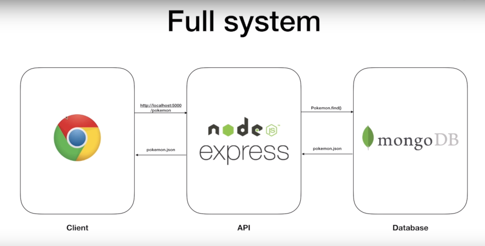
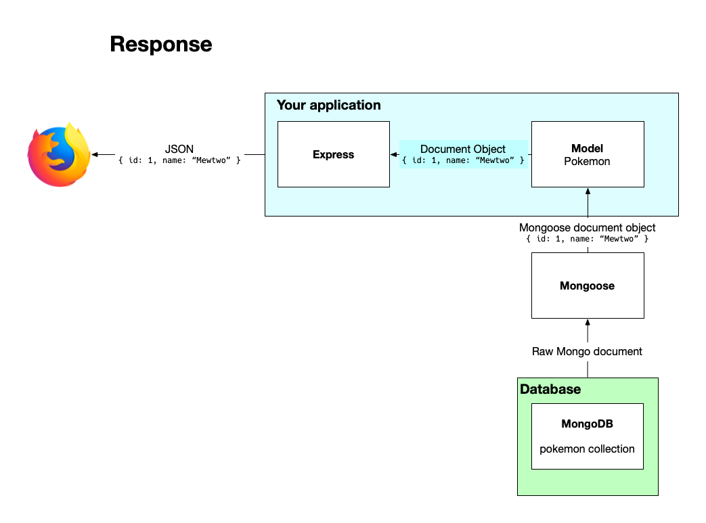

# Max's Notes: 

## Mongoose

- Express apps can use any database supported by Node.js as Express itself doesn’t define any specific additional behavior/requirements for database management. There are many popular options, including PostgreSQL, MySQL, Redis, SQLite and MongoDB.

- There are two approaches for interacting with a database:
  - Using the databases’ native query language (e.g. SQL).
  - Using an Object Data Model (“ODM”) or Object Relational Model (“ORM”) tool. An ODM/ORM allows JavaScript objects to be mapped to the schema of an underlying database.

- As we’re using MongoDB as our database we’ll be using an ODM tool and in this case, we are using Mongoose.
- The browser loads up a web page using a URL, in this case, pointing to localhost.
- The web page has a script making a GET request to the server over port 3333 asking for the /pokemon endpoint.
- The node and express layer processes the request by calling any function we have assigned to the route and request method. Within the function we will use Mongoose, which will in turn connect to MongoDB and retrieve the documents.
- The node and express layer processes this and sends it to the client as a response.






### Setup example:

1. Create an npm project directory with `npm init`.
2. Install the following dependencies:
  `npm install express`
  `npm install mongoose`
  `npm install nodemon`
3. Add the `"start": nodemon index.js` script to `package.json`
4. Set up the below dependancies
```
const express = require('express');
 const app = express();
 const mongoose = require('mongoose');
 const PORT = 3000;

 // Body-parser configuration
 app.use(express.json())

 // This is a built-in middleware function in Express.
 // It parses incoming requests with JSON payloads and is based on body-parser.
```
5. Connect to the PORT
```
 // connecting to the port
 app.listen(PORT, () =>
 {
   console.log( `Listening on port ${PORT}` );
 } );
```
6. Connecting to the database:
  - By default, the MongoDB server runs on port 27017. When you run mongo in your teminal, it informs you where the mongo server is running.
  - The URI for MongoDB server is mongodb://localhost:27017/nameOfDatabase. mongodb://localhost/nameOfDatabase works as well if you are using the default port.
  - Let’s save the URI in a variable and connect to the database: 
  - For example below:
```
// Define the development database
const mongoURI = 'mongodb://localhost/pokemondb';

// Connecting to mongodb from your application
mongoose.connect( mongoURI, { useNewUrlParser: true }, (err) =>
{
  if(err)
  {
    return console.log( `${err}` );
  } else {
    console.log( "Connected to MongoDB" );
  }
});
```

### Creating a Mongo schema.
7. Everything in Mongoose starts with a schema. Create a new folder `models`
8. Create a new file example `pokemonData.js`
9. In `pokemonData.js` put the below code: In the below we create a new schema and have the collection called pokemon. NOTE: If we leave it unnamed then it will name it automatically as 'pokemons'
  - Note: If you make `_id:` then you can use the automatic mongoDB ID.
```
const Pokemon = require(' ./models/pokemon' );

// The below is creating the collection in our database
const pokeSchema = new mongoose.Schema(
  {
    id: Number,
    name: String,
    height: Number,
    moves: Array,
    image: String
  },
  { 
    // The below specifically names the collection
    collection: 'pokemon'
  }
);

module.exports = mongoose.model('pokemon', pokeSchema);
```

- Note you can do quality check on the data as well like the below:
```
const pokeSchema = new mongoose.Schema(
  {
    id: {
      type: Number,
      required: true
    },

    name: {
      type: String,
      required: false
    },

    height: {
      type: Number,
      required: false
    },

    moves: {
      type: Array,
      required: false
    },
    
    image: {
      type: String,
      required: false
    }
  }
);
```
### Routing, Adding, removing and deleting 

10. Here we can use express with mongo and using GETS, DELETE, PUTS, POST on our database. Below is getting all the pokemon. 
```
app.get( '/pokemon', (req, res) => {
    Pokemon.find( {} ).then( allPokemon => {
      console.log( allPokemon );
      return res.json( allPokemon );
    }).catch( err => res.json( err ) )
});
```
11. The below is getting the individual pokemon based on id
```
app.get('/pokemon/:id', (req, res) => {
  const {id} = req.params;

  Pokemon.findOne({id: id}).then((poke) => {
    console.log(poke);
    res.json(poke);
  }).catch((err) => res.json(err))
});
```
12. The Below is creating the Pokemon 
```
app.post('/pokemon', (req, res) => {
  const {id, name, height, moves, image} = req.body;

  // This will return a promise which is why we need to do .then
  // Pokemon.create is how you create a new pokemon with mongoose
  Pokemon.create({id, name, height, moves, image}).then((newPoke) => {
    res.json(newPoke)
  }).catch((err) => res.json(err))
});
```

13. The below is updating a record
```
// Below is updating the pokemon name with the newName we enter
app.put('/pokemon/:id', (req,res) => {
  const {id} = req.params;
  const {newName} = req.body;
  // Its then going to access the name and save the new ne
  Pokemon.findOne({id}).then((poke) => {
    poke.name = newName;
    poke.save().then((doc) => {
      res.send(`${doc.name} has been updated`);
    }).catch((err) => console.log(err))
  }).catch((err) => res.json(err))
});
```
14. Below is deleting a record
```
app.delete('/pokemon/:id', (req, res) => {
  const {id} = req.params;

  // Below is a mongo command and it finds the pokemon with the id and deletes it
  Pokemon.findOneAndDelete({id}).then((doc) => {
    if (doc) {
      res.send(`${doc.name} deleted from DB`);
    } else {
      res.send(`No Pokemon found with id ${id}`);
    }
  }). catch((err) => res.join(err));
});
```

13. If you then go into `postman` and post a pokemon it will create the record.
  - You can then go into your mongoDB by going into the terminal and going:
  1. `monogo`
  2. `show dbs`
  3. `use <dbName>`
  4. `show collections`
  5. `db.<collectionName>.find()` - This will display everything back.

14. Checking if something is unique or not


## Tokens

- In order to setup an authenticated session that continues until a user logs off, we can generate an encrpyted token on the server and pass it to the client; this can then be stored and sent to the server in the header each time the client makes a request.
- This can all happen thanks to JSON Web Tokens (JWT).


1. Create a npm project `npm init`
2. install express `npm install express`
3. install json web token `npm install jsonwebtoken`
4. Create a folder called `config.js` In this file run the below:
- The below code takes the token and then makes it unique  
```
module.exports = {
  secret: 'this_is_a_secret_key_shh'
};
```
4. You then want to create a file called `token_middleware.js` and add the below code.
- The below code is where we check if a token exists, and verifies it.
```
let jwt = require('jsonwebtoken');
const config = require('./config.js');

// Middleware - checks if there is a valid token 
let checkToken = (req, res, next) => {
  // Express headers are auto converted to lowercase
  let token = req.headers['x-access-token'] ||
              req.headers['authorization'] || "";

  // An empty string allows the token to be treated as a string but will return false
  // Bearer is a browser auto input 
  if (token.startsWith('Bearer ')) {
    // Remove Bearer from string
    token = token.slice(7, token.length);
  }

  // Has token and then verifies with JWT token
  if (token) {
    // Pass in the token and the secret key into verify()
    jwt.verify(token, config.secret, (err, decoded) => {
      if (err) {
        return res.json(
          {
            success: false,
            message: 'Token is not valid'
          });
      }
      else {
        req.decoded = decoded;
        next();
      }
    });
  }
  // can't find token
  else {
    return res.json({
        success: false,
        message: 'Auth token is not supplied'
      });
  }
};

module.exports = {
  checkToken: checkToken
}
```

5. Then create your `index.js` 
- In this we create the tokens and we check if the password and username match the mock ones.
- 
```
const express = require('express');
let jwt = require('jsonwebtoken');
let config = require('./config.js');
let middleware = require('./token_middleware');

let app = express();
app.use(express.json());

const PORT = 5000;

// Below is a function for logging in and accessing the token
function login(req, res) {
  let { username, password } = req.body;

  // For the given username fetch user from DB
  let mockedUsername = 'admin';
  let mockedPassword = 'password';

  if (username && password) {
    if (username === mockedUsername && password === mockedPassword) {
       // The below generates a token
      let token = jwt.sign({ username: username },
        config.secret,
        // this removes it after 24hrs
        { expiresIn: '24h' });

      // Return the JWT token for the future API calls
      res.json(
        {
          success: true,
          message: 'Authentication successful!',
          token: token
        });
    }
    else {
      res.sendStatus(403).json(
        {
          success: false,
          message: 'Incorrect username or password'
        });
    }
  }
  else {
    res.sendStatus(400).json(
      {
        success: false,
        message: 'Authentication failed! Please check the request'
      });
  }
};

// This is an index page function
function index(req, res) {
  res.json({
    success: true,
    message: 'Index page'
  });
};

// The below is similar to do app.get and app.post, it just calls the functions directly
app.post('/login', login);
app.get('/', middleware.checkToken, index);

app.listen(PORT, () => console.log("Server is listening"));
```