# Day 64 

## Assignment 
- Working in groups of 2/3 with working on the assignment.
- Groups going to be randomly
- Cannot sign an NDA
- Assignment will be released next week

## MongoDB Atlas 

- MongoDB Atlas is a fully-managed cloud database developed by the same people that build MongoDB. Atlas allows you to deploy and manage a MongoDB database on many different cloud service providers (including AWS, Azure and GCP). Follow the links below to get started.
- https://www.mongodb.com/cloud/atlas

- Step 1: Create an account by using: https://www.mongodb.com/download-center
- Step 2: Fill in the information like the below image:

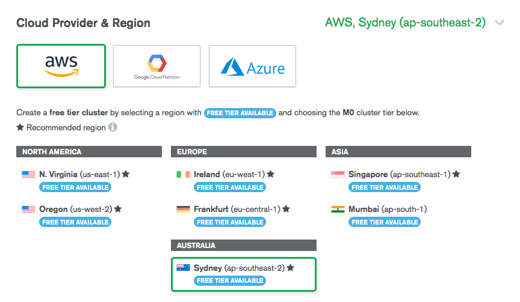

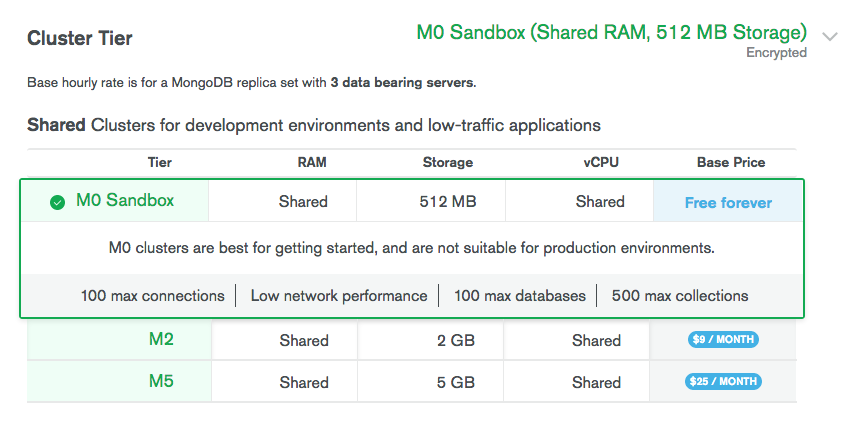

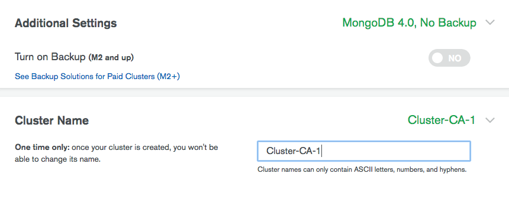

- Step 3: Once you have created the cluster you will be directed to the dashboard:

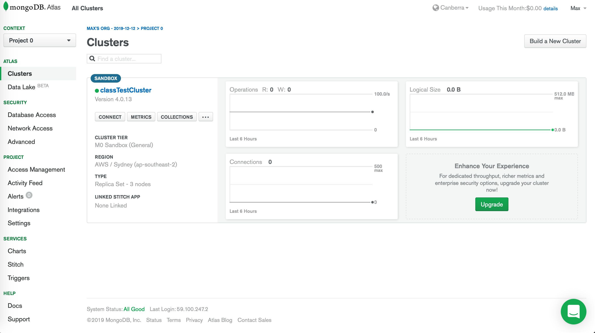

- Step 4: You will then need to create a user to access the database

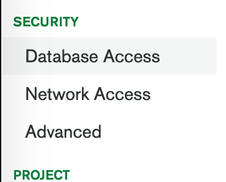

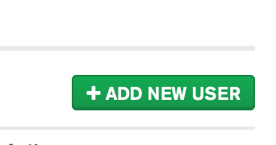

- Step 5: You then create your user, enter the username and password which will be used to login to the database


- Step 6: You then need to go and create a network access - To get the IP of an address in your terminal run `ping <addresURL>`

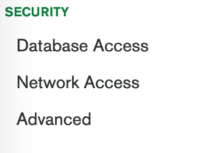

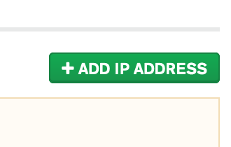

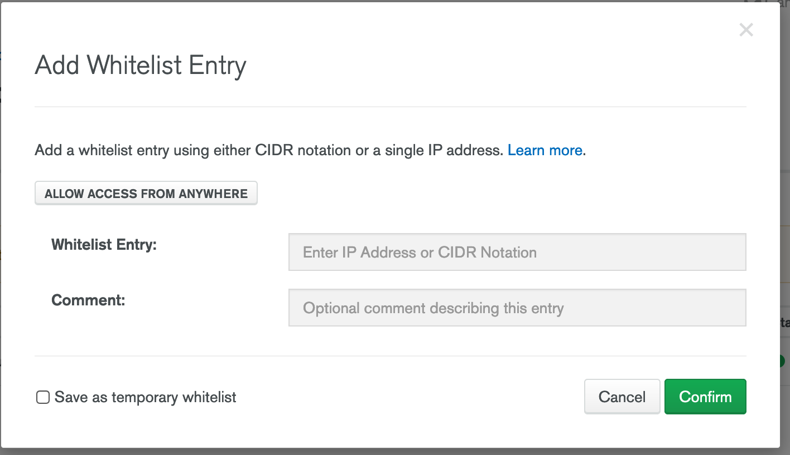

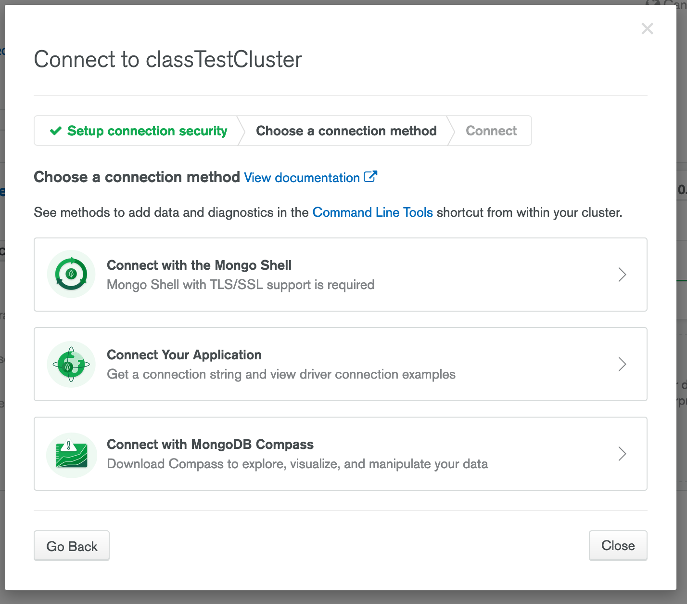

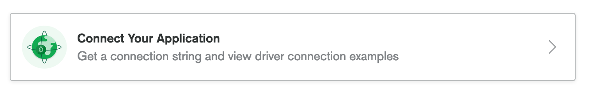

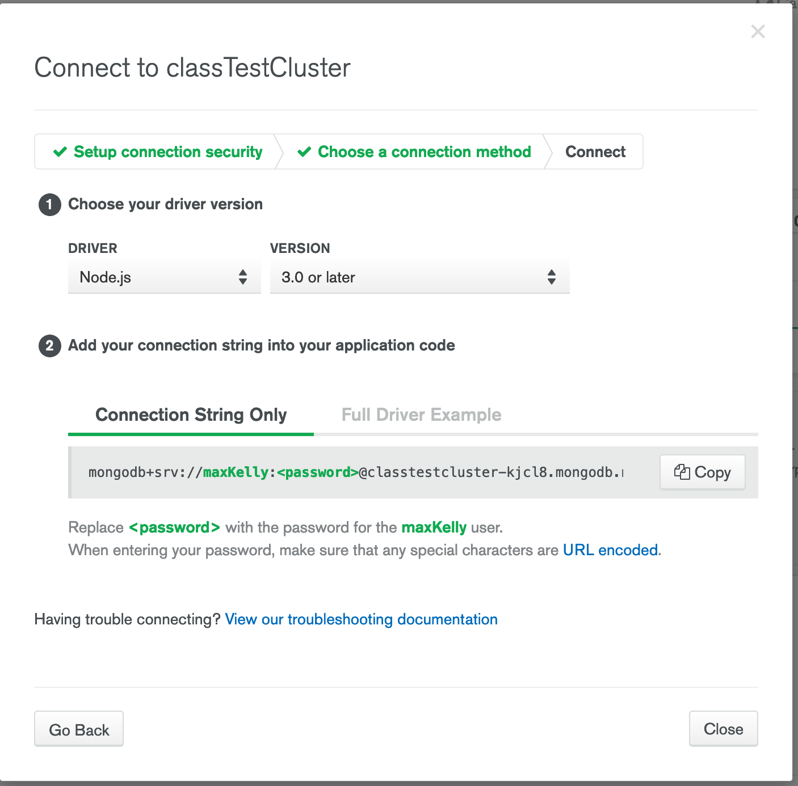

- Step 7: You then want to add this to your app. Using a env file. Create a `.env` file in root
- You want to also install an npm `npm install dotenv`
- Step 8: In your `.env` add `DB_URI=mongodb+srv://maxKelly:<password>@marketplacetest-kjcl8.mongodb.net/test?retryWrites=true&w=majority`
- Step 9: Create a `.gitignore` file in root
- Step 10: In your `.gitignore` add `.env` this ignores the .env file
- Step 11: You then want to call that URL within your code so: `const mongoURI = process.env.DB_URL;` 
- Step 12: And when you connect to the db
```
mongoose.connect(mongoURI, {useNewUrlParser: true}, (err) => {
  if (err) {
    return console.log(`Error: ${err}`);
  } else {
    console.log("Connected to mongoDB")
  };
});
``` 


## NOW Package

- There are a plethora of different options for deployment Express projects; one option we could use again is Heroku.
- This time though, we are going to use a new service called Now. Now can be used for heaps of different types of deployments including React but for this course we’re just going to use it for our Express back ends.

- Install NOW globally `npm install -g now`
- Run `now login` 
- Enter in your email address - NOTE: If you don't have an account you will need to create one through the link they provide you


