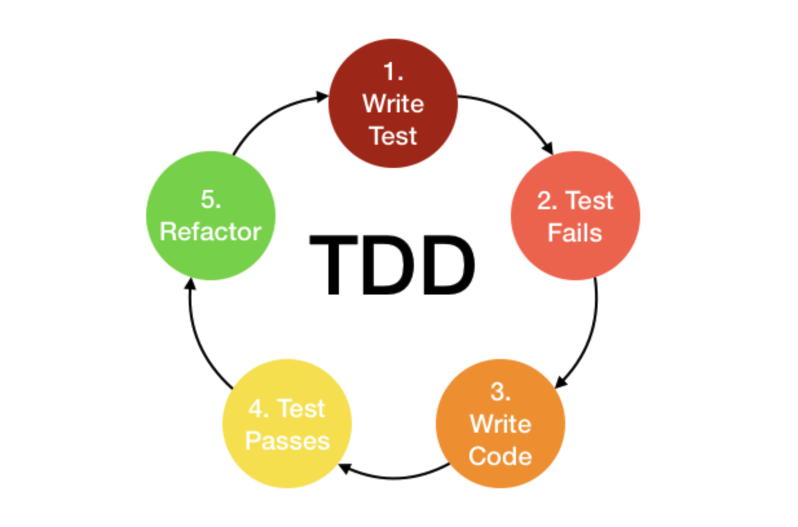

# Day 73 - Group assignment, Jest, Assignment Part A

- Today I worked on the group assignment for the first morning,
- Then we covered Jest testing and 
- I worked on the assignment due this Sunday.


## Jest with Express - Automated Testing 

- TDD = Test Driven Development 
- Using Jest with Express 
- Positive testing is almost only one outcome. 
- Negative testing is almost infident with the outcomes
- Testing should never test the internals of the function it should be what is put into the function and the output

- Below is what you can call in your testing
```
.toBe
.toEqual
.toBeNull
.toBeUndefined
.toBeDefined
.toBeTruthy
.toBeFalsy

//Some expectations which can be used with numbers
.toBeGreaterThan
.toBeGreaterThanOrEqual
.toBeLessThan
.toBeLessThanOrEqual
.toBeCloseTo

//Some expectations which can be used with strings
.toMatch

//Some expectations which can be used with arrays
.toContain


All these expectations listed above can be used with .not prefix to see if it is the opposite of the expectation. 
```



1. `npm init -y`
2. `npm install -D jest` - This installs only for the development
3. Go into `package.json` and change the below; NOTE: The below `--coverage` allows you jest to report back to you what percent of your code is covered by tests

```
{
  "name": "jest-in-class",
  "version": "1.0.0",
  "description": "",
  "main": "index.js",
  "scripts": {
    "test": "echo \"Error: no test specified\" && exit 1"
  },
  "keywords": [],
  "author": "",
  "license": "ISC",
  "devDependencies": {
    "jest": "^24.9.0"
  }
}
```
TO:

```
{
  "name": "jest-in-class",
  "version": "1.0.0",
  "description": "",
  "main": "index.js",
  "scripts": {
    "test": "jest --coverage"
  },
  "keywords": [],
  "author": "",
  "license": "ISC",
  "devDependencies": {
    "jest": "^24.9.0"
  }
}
```

4. We then create a new file named `mathOps.js` and put the below: 

```
const add = (num1, num2) => {

}

const addAll = (numArray) => {

}

const subtract = (num1, num2) => {

}

const multiply = (num1, num2) => {

}

const multiplyAll = (numArray) => {

}

const divide = (num1, num2) => {

}

module.exports = { add, addAll, subtract, multiply, multiplyAll, divide };
```

5. We then create a file `mathOps.test.js` - This is where we put all the tests like the below:

```
const { add, addAll, subtract, multiply, multiplyAll, divide } = require("./mathOps.js");

test('This will test the addition of two numbers', () => {
  // The below is saying we expect the outcome of add to be 7
  expect( add(5, 2) ).toBe(7);
});

test('This will test the validity of the input for the add function ', () => {

  // The below is saying 
  const inputValidity = () => {
    add("Hello", "World");
  }

  expect(inputValidity).toThrow(TypeError);
});
```

6. To run the tests you do `npm test`
7. We then need to build out our functionality in `mathOps.js` more like the below:

```
const add = (num1, num2) => {
  if (typeof(num1) !== "number" || typeof(num2) !== "number") {
    throw new TypeError("Not a valid number");
  }

  return num1 + num2;
};

const addAll = (numArray) => {

};

const subtract = (num1, num2) => {

};

const multiply = (num1, num2) => {

};

const multiplyAll = (numArray) => {

};

const divide = (num1, num2) => {

};

module.exports = { add, addAll, subtract, multiply, multiplyAll, divide };
```

8. If you now run `npm test` then the two tests will run
9. Now we can use the `spyOn` which allows us to see the `console.logs`. This is shown below:

- `mathOps.js`

```
const add = (num1, num2) => {
  if (typeof(num1) !== "number" || typeof(num2) !== "number") {
    throw new TypeError("Not a valid number");
  }

  return num1 + num2;
};

const addAll = (numArray) => {

};

const subtract = (num1, num2) => {

};

const multiply = (num1, num2) => {

};

const multiplyAll = (numArray) => {

};

const divide = (num1, num2) => {

};

const printBinString = (num) => {
  let binString = "";
  if (num <= 1 && num > 0) {
    console.log(num);
  }
  else if (num > 1) {
    while (num > 1) {
      binString = (num % 2) + binString;
      num = Math.floor(num / 2);
    }

    binString = num + binString;
  }

  console.log(binString);
}

module.exports = { add, addAll, subtract, multiply, multiplyAll, divide, printBinString };
```

```
const { add, addAll, subtract, multiply, multiplyAll, printBinString, divide } = require("./mathOps.js");

test('This will test the addition of two numbers', () => {
  // The below is saying we expect the outcome of add to be 7
  expect( add(5, 2) ).toBe(7);
});

test('This will test the validity of the input for the add function ', () => {

  // The below is saying 
  const inputValidity = () => {
    add("Hello", "World");
  }

  expect(inputValidity).toThrow(TypeError);
});

test('Test if the console log of binary string is as expected ', () => {

  const log = jest.spyOn( global.console, 'log');

  printBinString(320);
  expect(log).toHaveBeenCalledWith( '101000000');
})
```